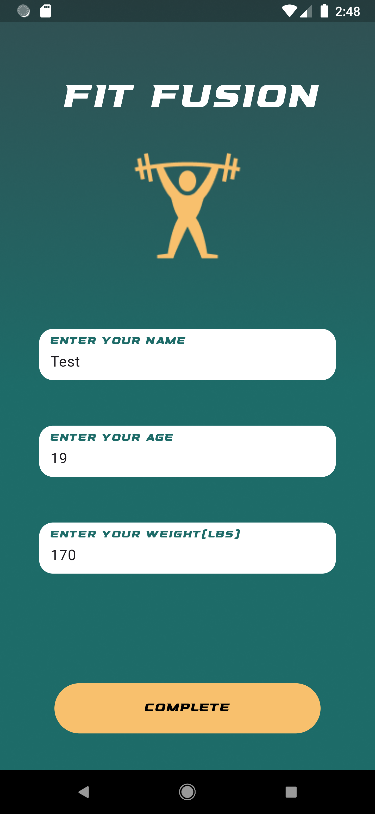
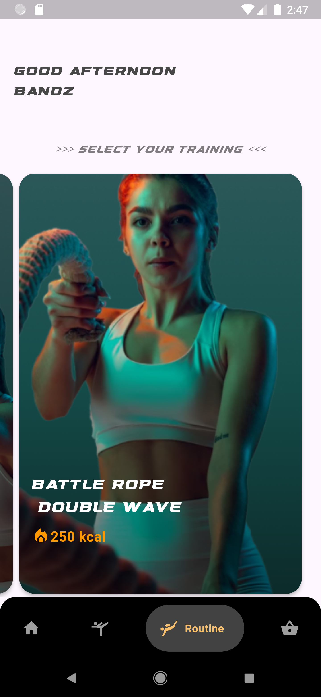

# Fit Fusion: Your Personalized AI Health and Fitness Coach

## Overview

**FitGem** is a cutting-edge Flutter app that leverages the power of Gemini AI to deliver personalized health and fitness plans. Designed to cater to individual needs, FitGem helps users achieve their fitness goals with customized workouts, nutrition plans, and real-time feedback.


<div align="center">
	
    
    
    
</div>


## Features

- **Personalized Fitness Plans**: Tailored workout routines based on user data (age, weight, fitness level, goals).
- **Nutrition Guidance**: Customized meal plans to meet dietary needs and preferences.
- **Progress Tracking**: Monitor progress and receive adjustments to fitness and nutrition plans.
- **Real-Time Feedback**: AI-powered suggestions and feedback during workouts.
- **Health Insights**: Analyze health data to provide actionable insights and recommendations.

## Installation

1. Clone the repository:
    ```bash
    git clone https://github.com/IrunguNjagi/fit_fusion.git
    ```
2. Navigate to the project directory:
    ```bash
    cd FitGem
    ```
3. Install dependencies:
    ```bash
    flutter pub get
    ```
4. Run the app:
    ```bash
    flutter run
    ```

## Usage

1. **Sign Up / Log In**: Create an account or log in to your existing account.
2. **Profile Setup**: Enter your personal details and fitness goals.
3. **Get Started**: Receive your personalized fitness and nutrition plans.
4. **Track Progress**: Monitor your progress and get real-time feedback and adjustments.
